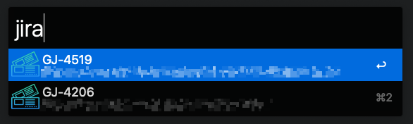

# My JIRA Tickets

Alfred workflow to fetch all open JIRA tickets assigned to you.  

Functionality:

* copies the ticket id to clipboard `↩` (e.g. `GJ-1234`)
* copies the git branch name to clipboard `⌃↩` (e.g. `GJ-1234-fix-a-bug`)
* copies the PR description to clipboard `⌥↩` (e.g. `GJ-1234 Fix a bug`)
* opens the ticket url in the browser `⌘↩`

Built in one minute cache.

### Install

    npm install --global @hoto/alfred-my-jira-tickets
    # will open a text editor where you enter secrets (jira url, email, api key)

<a href="https://www.flaticon.com/free-icons/boarding-pass" title="boarding pass icons">Boarding pass icons created by winnievinzence - Flaticon</a>